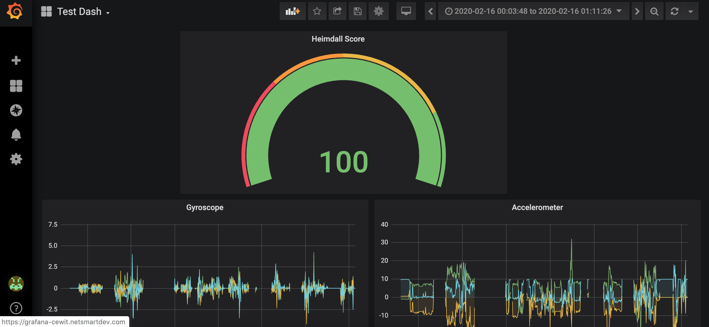

# GiatKeeper: A Zero-login Authentication System

  

# Inspiration
A fundamental limitation of today's authentication systems is that they require users to authenticate themselves manually. 
Instead, we envision a zero-login authentication system that is ultra secure yet requires no user input, using our proposed GaitKeeper system. 

# What it does
The GaitKeeper is an authentication service that provides a user trust score without user interaction.
GaitKeeper achieves secure and interactionless authentication by learning a user's unique _gait_ and combining it with user device history.
In this way, GaitKeeper can determine whether if a user is truly who they claim to be including when a user's device is compromised.

# How we built it
There are three parts to the GaitKeeper service:
1. A client side service that continually runs on an user's device to model their behavior and carry out authentication.
2. A backend server that collects user gait behavior and cotinually runs a ML model to update and monitor this behavior. We collect the device trust score from Payfone Inc and combine it with our sensor data to propose a unified metric called 'Heimdall score'.
3. This is shown A reporting portal that allows users and admins to view recent changes to their Heimdall Score.

# Challenges we ran into
A key challenge in achieving this interactionless authentication system is that there is no one metric that can identify a user perfectly. It is nontrivial to use identify a user with any single metric. 
GaitKeeper solves this challenge by leveraging multitudes of sensor data from users' smartphones to model their corresponding user behaviour, thereby identifying the user identity. Another key challenge is that it is extremely hard to fuse this large data from sensors in an efficient way. GaitKeeper derives a blackbox model to understand the complex relationships among the sensors data using the neural networks.

# Accomplishments that we're proud of
One major benefit of GaitKeeper is that it can compute the Heimdall score with no additional cost to end users. The sensor data is ubiquoutous. There is no need to change the user's device hardware. Existing the authentication systems such as Payfone Inc can use this model directly in their system instead of just trust score. We are extremely proud of the accuracy and the responsivenes of Heimdall score compared to Payfone's trust score. 

# What we learned
We first learned a great deal of Payfone's authentication APIs to get their trust score feature for our model. This involved learning Android App development, tweaking Java code, Rest calls etc. Another interesting takeaway from the project is that there is a lot of data generated by smartphones sensors that is used for several other purposes apart from authentication. A fun fact: we learned that you cannot know your mobile number programmatically, and Payfone provides a neat way to retrieve it. 

# What's next for GaitKeeper
We envision multiple future directions for GaitKeeper. First, responsiveness of GaitKeeper is very important specifically when it scales to millions of users. A commercial authentication provider such as Payfone can take this further and develop a decentralized verison of GaitKeeper for scalability, elasticity and efficiency purposes. Second, GaitKeeper can be transformed into a generic platform that collects any type of data, fuses the data using machine learning, and provides APIs for developers to operate the data. 
